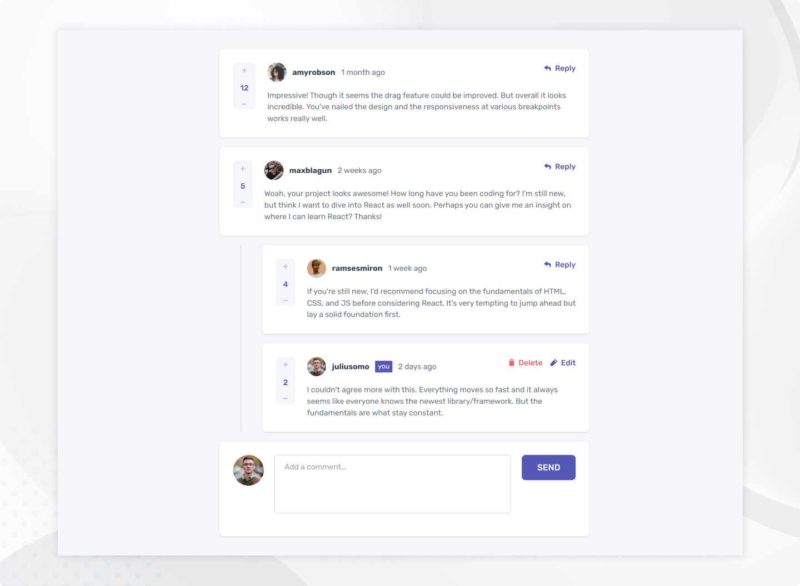

# Frontend Mentor - Interactive comments section solution

This is a solution to the [Interactive comments section challenge on Frontend Mentor](https://www.frontendmentor.io/challenges/interactive-comments-section-iG1RugEG9). Frontend Mentor challenges help you improve your coding skills by building realistic projects.

### The challenge

Users should be able to:

- View the optimal layout for the app depending on their device's screen size
- See hover states for all interactive elements on the page
- Create, Read, Update, and Delete comments and replies
- Upvote and downvote comments
- **Bonus**: If you're building a purely front-end project, use `localStorage` to save the current state in the browser that persists when the browser is refreshed.
- **Bonus**: Instead of using the `createdAt` strings from the `data.json` file, try using timestamps and dynamically track the time since the comment or reply was posted.

### Screenshot

### Links

- Solution URL: [GitHub](https://github.com/DorottyaB/interactive-comments-section-with-react)
- Live Site URL: [interactive-comments-section-dorottyab.vercel.app](https://interactive-comments-section-dorottyab.vercel.app/)

### Built with

- React
- Redux Toolkit
- Tailwind CSS
- Flexbox
- CSS Grid
- Mobile-first workflow

## Author

- Website - [Dorottya](https://github.com/DorottyaB)
- Frontend Mentor - [@DorottyaB](https://www.frontendmentor.io/profile/DorottyaB)
